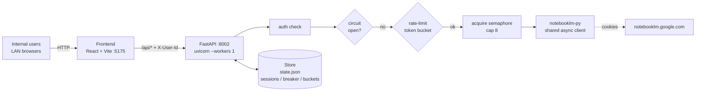
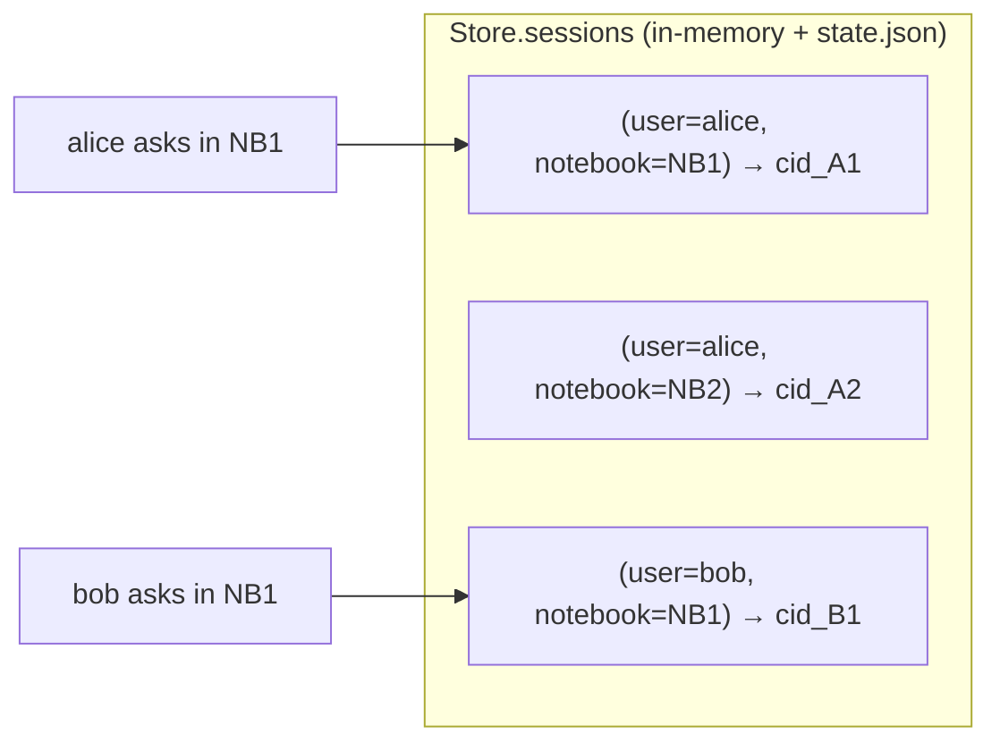
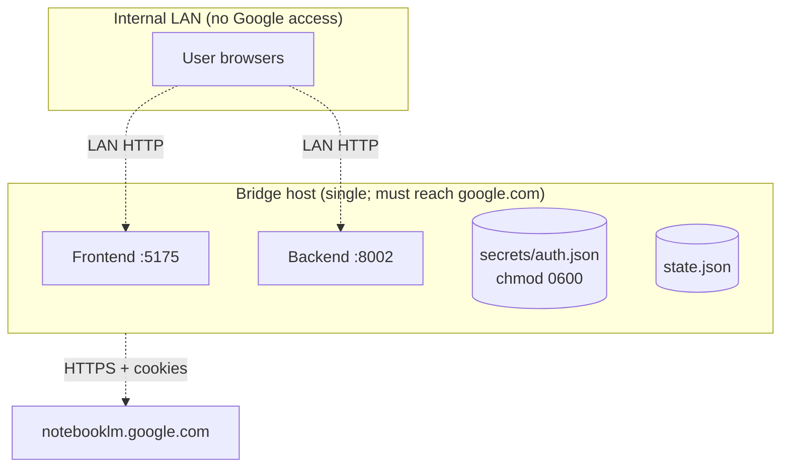

# notebooklm-bridge

> Share one Google account's NotebookLM with an intranet team — without
> giving every teammate Google access.

A small FastAPI + React bridge that fronts a single
[`notebooklm-py`](https://github.com/teng-lin/notebooklm-py) client and serves
multi-user chat over the LAN. Internal users hit the bridge in their browser;
the bridge talks to `notebooklm.google.com` from a host that *can* reach
Google. A Feishu (Lark) bot adapter is planned as Phase 3 and is **not** part
of v1.0.

**Status: v1.0.8** — first internal-ready release. See
[`CHANGELOG.md`](CHANGELOG.md). Project-wide engineering rules (no AI
signatures in commits, `--workers 1` lock, port pinning, etc.) live in
[`CLAUDE.md`](CLAUDE.md); the design rationale lives in [`plan.md`](plan.md).

---

## Table of Contents

- [What this is](#what-this-is)
- [Architecture](#architecture)
- [Tech stack](#tech-stack)
- [Features](#features)
- [Quick start (IT operator)](#quick-start-it-operator)
- [Production deployment notes](#production-deployment-notes)
- [Configuration](#configuration)
- [API reference](#api-reference)
- [Operations](#operations)
- [Developer setup](#developer-setup)
- [Testing](#testing)
- [Project layout](#project-layout)
- [Roadmap](#roadmap)
- [License & maintenance](#license--maintenance)

---

## What this is

A self-contained **internal bridge**, *not* a SaaS:

- **Built for**: a team of ≤ ~30 internal users that already shares one
  curated NotebookLM workspace and needs LAN-only access to it.
- **Not built for**: public exposure, external tenants, federated identity,
  high-volume RAG over arbitrary content.

**Hard constraints** (see `CLAUDE.md` §3 for the full list):

- The bridge host must be able to reach `https://notebooklm.google.com`.
- Exactly **one** uvicorn worker — `notebooklm-py` is async re-entrant but
  not thread-safe, so multiple workers would shred the shared client.
- Starting ports: backend **`:8002`**, frontend **`:5175`** (match sibling
  tools in the same workspace). `start-web.sh` probes `[start, start+9]` and
  picks the first free port; vite is `strictPort: true` so the dev server
  never silently bumps on its own — probing is the shell script's job.
- Cookies and the shared HTTP secret never enter the repo or release
  tarball — the operator places them on the target host out-of-band.

---

## Architecture

### Request flow



Every `/api/chat` flows through the same chokepoint in order:
**auth → circuit breaker → per-user rate limit → global semaphore → upstream
ask → bounded timeout**. A single slow query *cannot* trip the breaker; only
upstream 429/5xx do (`backend/routes/chat.py` for the exact contract).

### Component breakdown

| Layer | Module | Responsibility |
|---|---|---|
| Frontend | `frontend/src/` | React 19 three-column UI; Markdown rendering; citation drawer; localStorage history (per-user prefixed) |
| HTTP API | `backend/routes/` | `/healthz`, `/notebooks`, `/sources`, `/sources/{id}/fulltext`, `/chat`, `/chat/reset`, `/chat/select` |
| Auth | `backend/auth.py` | `X-User-Id` header validation (LAN trust boundary; v1.0.3 dropped the previous shared-secret check) |
| Concurrency | `backend/routes/chat.py` + `backend/app.py` | Circuit breaker, per-user token bucket, global semaphore |
| State | `backend/store.py` | Singleton in-memory dicts + debounce-persisted JSON file |
| Upstream | `backend/client.py` | Wraps `notebooklm-py`; cookies keepalive; degraded-mode fallback when cookies are missing |

### Multi-user isolation model

The bridge talks to **one** Google account via **one** `NotebookLMClient`,
yet keeps each internal user's conversation separate by namespacing the
upstream `conversation_id`:



The frontend mirrors this by namespacing all browser-side state on
`user_id`: `nblm_history:<uid>`, `nblm_turns:<uid>:<cid>`,
`nblm_notebook_id:<uid>`, etc. A "switch user" action in the top bar wipes
only the *who-is-logged-in* pointer (`nblm_user_id`), so the previous user's
local history survives if they come back.

---

## Tech stack

| Layer | Tech | Pinned |
|---|---|---|
| Bridge HTTP | FastAPI + uvicorn (single worker) | `fastapi>=0.115`, `uvicorn[standard]>=0.32` |
| Validation | `pydantic`, `pydantic-settings` | `>=2.9`, `>=2.6` |
| NotebookLM | [`notebooklm-py`](https://github.com/teng-lin/notebooklm-py) — single re-entrant async client per process; `--workers 1` enforced | `==0.4.1` |
| Persistence | In-memory dicts + debounce-flushed JSON file (`state.json`) — no Redis, no DB | — |
| Frontend | React 19 + Vite 5 + TypeScript | `react 19.2`, `vite 5.4`, `typescript 5.9` |
| UI primitives | Radix UI (Dialog / Popover / Dropdown / ScrollArea / Tooltip), Tailwind v4 | — |
| Tests | pytest + pytest-asyncio + asgi-lifespan + httpx | `>=8`, `>=0.24`, `>=2.1` |

Backend starts at **`:8002`**, frontend at **`:5175`** (`CLAUDE.md` §3.2).
`start-web.sh` auto-increments up to +9 if the starting port is busy; vite
itself is `strictPort: true` so the dev server never silently shifts on its
own (the shell script owns the probing). Actual selected ports live in
`.runtime-ports.json`.

---

## Features

### End-user features

- **Chat with citations** — every answer streams back as Markdown with
  inline `[n]` citation chips.
- **Citation drawer** — clicking a chip slides out a side drawer showing
  the source's full text with the cited passage highlighted. Four-level
  fallback (L1 = 40-char exact / L2 = 25-char / L3 = whitespace-normalised /
  L4 = 15-char fuzzy) plus a `miss` badge so the user knows whether the
  highlight is precise.
- **History popover** — recent 20 conversations per user, filtered to the
  current notebook, click to restore turns. "Clear this notebook's history"
  button with confirm dialog.
- **Multi-user identity** — first-visit modal captures the operator's
  internal name or employee ID; avatar + "switch user" dropdown in the
  top bar.
- **Dark / light theme** — `next-themes`, system-default by default.
- **Notebook switcher** — top-bar dropdown of every notebook the shared
  Google account can see (30s cache).
- **Source panel** — left rail lists every source in the active notebook
  with type and processing status.

### Operator features

- **`GET /api/healthz`** — unauthenticated; returns `auth_valid`,
  `inflight_asks`, `circuit_open`. Wire this to your alerting.
- **Three-layer concurrency guard** — per-user token bucket (burst 3,
  refill 10/min) → global semaphore (default cap 8) → 30s circuit breaker
  after upstream 429/5xx. One shared Google account, no thundering-herd
  retry storm.
- **Persistent sessions** — `state.json` debounce-flushed (1s trailing);
  `SIGKILL` loses at most one second of writes.
- **Supervisor self-heal** — `scripts/_supervise.sh` restarts a single
  crash; >5 crashes in 30s trips a 30s back-off.
- **Cookies keepalive** — background task refreshes session at
  `NOTEBOOKLM_KEEPALIVE_SECONDS` (default 1800s).
- **Strict secret hygiene** — `secrets/` and `.env` are gitignored and
  excluded from the release tarball; the operator mints `auth.json` on the
  deploy host itself via `scripts/login.sh` (which sets `chmod 0600`).

### Not yet implemented

- Copy answer / regenerate / edit-last-question (planned for **v1.1**)
- Mobile-responsive layout (planned for **v1.1**)
- Feishu / Lark bot adapter (**Phase 3**, outside v1.0)
- Studio (Audio Overview / Mind map) (**Phase 4**, optional)

---

## Quick start (IT operator)

**TL;DR — four shell commands on the deploy host.** Required: Linux with
a desktop environment (GNOME / KDE / XFCE / …), outbound access to
`google.com` and `cdn.playwright.dev`, Python ≥ 3.11, Node ≥ 18.

> **Multiple Python versions on the host?** If the system default `python3`
> is older than 3.11 but `python3.11` is also installed, `deploy.sh` /
> `update.sh` auto-pick the newer one (probe order: `python3.11 → python3.12
> → python3`). If `python3.11` lives outside `$PATH`, override with
> `PYTHON_BIN=/full/path/to/python3.11 bash deploy.sh`. See
> [`scripts/README_DEPLOY.md`](scripts/README_DEPLOY.md) §1.1.

```bash
# 1. Unpack the release tarball
tar -xzf notebooklm-bridge-v1.0.8.tar.gz
cd notebooklm-bridge-v1.0.8

# 2. Install everything offline (creates .venv + .env from template)
bash deploy.sh

# 3. Sign in to NotebookLM with YOUR Google account
#    (pops a real Chromium window — sign in, open the target notebook once,
#     then close the browser)
bash scripts/login.sh

# 4. Start the bridge
bash scripts/start-web.sh
```

Verify:

```bash
# Default backend port is 8002. If 8002 was busy when start-web.sh ran, it
# auto-incremented up to +9 (so 8003, 8004, …); the actual port is in
# .runtime-ports.json or shown by `bash scripts/status-web.sh`.
curl -s http://localhost:8002/api/healthz | jq
# Expect: { "auth_valid": true, "inflight_asks": 0, "circuit_open": false, ... }
```

Then open `http://<deploy-host>:5175` in a LAN browser (frontend port follows
the same auto-increment rule).

### Ports — start-web.sh auto-increments if busy

`BACKEND_PORT` / `FRONTEND_PORT` in `.env` are **starting** ports (defaults
8002 / 5175). At launch, `start-web.sh` probes `[start, start+9]` and picks
the first free port for each service. The chosen pair is persisted in
`.runtime-ports.json` so `stop-web.sh` / `status-web.sh` / the frontend's
vite proxy all use the same numbers.

- Want a different starting port? Edit `.env`, restart. Do **not** edit
  the constants in `start-web.sh` / `vite.config.ts` / `stop-web.sh` —
  they no longer hold hard-coded ports.
- All 10 candidate ports busy? `start-web.sh` exits non-zero with a clear
  message; pick a different `BACKEND_PORT` in `.env` or free up the range.
- `start-web.sh --force` can kill a stale process **from this project**
  holding the starting port. It will not touch processes from other
  projects (those just trigger the auto-increment fall-through).

### When cookies expire

`/api/healthz` will start returning `auth_valid=false` (typically after
1–2 weeks). Re-run step 3 and restart:

```bash
bash scripts/login.sh
bash scripts/stop-web.sh && bash scripts/start-web.sh
```

That's the whole loop — no shuffling of cookie files between machines.

### What if the deploy host is headless / can't reach `cdn.playwright.dev`?

`scripts/login.sh` needs a desktop to pop the Chromium window, and the
first run downloads Chromium (~150MB) from `cdn.playwright.dev`. If
either is unavailable, see [`docs/cookie-refresh-runbook.md`](docs/cookie-refresh-runbook.md)
for the two-machine fallback (sign in on a laptop, `scp` the
`secrets/auth.json` over).

### Daily ops

```bash
bash scripts/start-web.sh            # 0.0.0.0 — LAN-reachable
bash scripts/start-web.sh --local    # 127.0.0.1 only
bash scripts/start-web.sh --force    # kill stale pid file from THIS project

bash scripts/status-web.sh           # supervisor health + port owner + log tail
bash scripts/stop-web.sh             # stop both supervisors
```

Each service runs under `scripts/_supervise.sh`. Logs default to
`.backend.log` / `.frontend.log` in the project root; override paths via
`BACKEND_LOG` / `FRONTEND_LOG` env vars.

---

## Production deployment notes

### Topology



### Building a release tarball (on the dev / packaging host)

```bash
scripts/pack.sh
# → dist/notebooklm-bridge-v1.0.8.tar.gz  (+ .sha256 sidecar)
```

The tarball bundles: backend `.py` sources, the pre-built frontend `dist/`,
offline pip `wheels/` (cp311 / manylinux2014_x86_64 only — see `pack.sh`),
the daemon scripts, `scripts/login.sh`, and `deploy.sh` / `update.sh` /
`README_DEPLOY.md` for the target host.

It does **not** bundle `secrets/`, `.env`, or `state.json` — credentials
are minted on the target host by `scripts/login.sh` (and the shared
secret is auto-generated by `deploy.sh`).

### Transferring to the bridge host

```bash
scp dist/notebooklm-bridge-v1.0.8.tar.gz user@bridge-host:~/
scp dist/notebooklm-bridge-v1.0.8.tar.gz.sha256 user@bridge-host:~/
ssh user@bridge-host 'sha256sum -c notebooklm-bridge-v1.0.8.tar.gz.sha256'
```

Then follow the four-step "Quick start" above on the bridge host.

### Upgrading an existing install

```bash
tar -xzf notebooklm-bridge-vNEW.tar.gz
cd notebooklm-bridge-vNEW
bash update.sh /path/to/old/install   # reuses .venv / .env / secrets
bash scripts/start-web.sh
```

`update.sh` carries over `.venv`, `.env`, and `secrets/auth.json` so you
don't have to re-login or regenerate the shared secret. `state.json` is
preserved too — sessions survive the upgrade.

`update.sh` carries over `.venv`, `.env`, and `secrets/` from the old
install so credentials don't have to be re-placed; `state.json` is also
preserved so sessions survive the upgrade.

The full operator checklist (firewall, file permissions, smoke tests) lives
in [`scripts/README_DEPLOY.md`](scripts/README_DEPLOY.md).

---

## Configuration

All env vars are loaded from `.env` (gitignored). Defaults from
`backend/config.py`.

| Env var | Default | Purpose |
|---|---|---|
| `NOTEBOOKLM_AUTH_JSON` | *(required)* | Absolute path to the cookies file exported via `notebooklm-py`. |
| `STATE_JSON` | *(required)* | Absolute path to the session-persistence JSON file. |
| `INTERNAL_FRONTEND_ORIGIN` | *(required)* | Single origin for FastAPI CORS allow-list. No wildcards (`CLAUDE.md` §3.6). |
| `BACKEND_HOST` | `0.0.0.0` | uvicorn bind host. |
| `BACKEND_PORT` | `8002` | Starting backend port — `start-web.sh` auto-increments up to +9 if busy and writes the selected value to `.runtime-ports.json`. |
| `FRONTEND_PORT` | `5175` | Starting frontend port — same auto-increment rule; read by `vite.config.ts` via `VITE_PORT` exported by `start-web.sh`. |
| `NOTEBOOKLM_KEEPALIVE_SECONDS` | `1800` | How often the keepalive task pokes upstream to keep cookies fresh. |
| `MAX_INFLIGHT_ASKS` | `8` | Global semaphore cap on concurrent `ask()` calls. |
| `RATE_LIMIT_PER_MINUTE` | `10` | Token-bucket refill rate, per user. |
| `RATE_LIMIT_BURST` | `3` | Token-bucket capacity, per user. |
| `ASK_TIMEOUT_SECONDS` | `60` | Per-request upstream timeout; trips 504 (does *not* open breaker). |
| `CIRCUIT_BREAKER_COOLDOWN` | `30` | Seconds the breaker stays open after an upstream 429/5xx. |
| `ALLOWED_NOTEBOOK_IDS` | *(empty = no allowlist)* | Comma-separated allowlist. Empty disables. |
| `LOG_LEVEL` | `INFO` | Standard Python logging level. |
| `BACKEND_LOG` / `FRONTEND_LOG` | `.backend.log` / `.frontend.log` | Log file paths (read by `scripts/start-web.sh`). |

---

## API reference

All non-`/healthz` endpoints require one header:

| Header | Value |
|---|---|
| `X-User-Id` | Free-form internal identifier (max 64 chars, no `\|`, no control chars). |

Up to v1.0.2 there was a second `X-Shared-Secret` header. v1.0.3 dropped it
— see `backend/auth.py` for the rationale.

| Method | Path | Purpose |
|---|---|---|
| `GET` | `/api/healthz` | Public health: `auth_valid` / `inflight_asks` / `circuit_open`. |
| `GET` | `/api/notebooks` | List of notebooks the shared account can see (30s cache). |
| `GET` | `/api/sources?notebook_id=…` | Sources inside a notebook (30s cache). |
| `GET` | `/api/sources/{source_id}/fulltext?notebook_id=…` | Full text of one source (for the citation drawer). |
| `POST` | `/api/chat` | Ask a question; returns answer + citations + `conversation_id`. |
| `POST` | `/api/chat/reset?notebook_id=…` | Start a fresh conversation for this `(user, notebook)`. 204. |
| `POST` | `/api/chat/select?notebook_id=…&conversation_id=…` | Resume a past conversation (history popover). 204. |

### `POST /api/chat` body

```json
{
  "notebook_id": "string",
  "question": "string",
  "source_ids": null,
  "reset": false
}
```

`source_ids` is optional; when provided, the answer's citations are
restricted to the listed sources (a subset of the notebook's source IDs).
`null` means "use all sources in this notebook". `reset: true` forgets the
current `(user, notebook)` conversation before asking — same effect as
calling `/api/chat/reset` first.

---

## Operations

### Health monitoring

`GET /api/healthz` returns JSON with three fields you'll want to watch:

- `auth_valid` — `false` means cookies are missing or expired. Page on
  `false` lasting more than a few minutes.
- `inflight_asks` — current count of in-flight upstream calls (0 to
  `MAX_INFLIGHT_ASKS`). Sustained near the cap means you should consider
  raising the limit.
- `circuit_open` — `true` means an upstream 429/5xx tripped the breaker.
  Self-clears after `CIRCUIT_BREAKER_COOLDOWN`. Sustained `true` for more
  than a couple of minutes means Google is genuinely refusing — check
  cookies and rate.

### Logs

Default: `.backend.log` and `.frontend.log` at the project root. Override
paths via `BACKEND_LOG` and `FRONTEND_LOG` env vars before calling
`scripts/start-web.sh`. Supervisor restart history is at the top of
`.backend.log` (the supervisor logs its own decisions).

### Runbooks

- Cookies expired / `auth_valid=false`: [`docs/cookie-refresh-runbook.md`](docs/cookie-refresh-runbook.md)
- Unexpected upstream errors / breaker won't close: [`docs/upstream-breakage-runbook.md`](docs/upstream-breakage-runbook.md)
- Starting port busy: `start-web.sh` auto-increments up to +9; `--force` kills a stale process **from this project** holding the starting port (won't touch other projects). All 10 candidates busy → change `BACKEND_PORT` in `.env`.
- Multiple Python versions on the host (3.9 + 3.11): set `PYTHON_BIN=/path/to/python3.11` before `deploy.sh` / `update.sh`. See `scripts/README_DEPLOY.md` §1.1.

---

## Developer setup

This section is for working on the project itself (writing backend / frontend
code, running tests, iterating). **IT operators should follow "Quick start
(IT operator)" above instead** — it skips the steps that only make sense in
a development checkout.

```bash
# 1. Backend deps (test + lint + type-check tooling)
pip install -e '.[dev]'

# 2. Frontend deps
cd frontend && npm install && cd ..

# 3. Env file
cp .env.example .env
# scripts/setup.sh handles this interactively (login + pin pyproject + smoke
# test), or you can just edit .env by hand. No INTERNAL_AUTH_SHARED_SECRET
# to fill in any more — v1.0.3 dropped that header.

# 4. Install notebooklm-py at the pinned version
pip install -e '.[runtime]'
# (scripts/setup.sh also pins this for you. Without notebooklm-py installed
#  the bridge runs in degraded mode — chat returns 503 but everything else
#  still works, which is useful for frontend-only iteration.)

# 5. Sign in to NotebookLM (writes ~/.notebooklm/profiles/default/storage_state.json
#    AND copies it into ./secrets/auth.json with chmod 600)
bash scripts/setup.sh
# or just the cookies portion:
notebooklm login
cp ~/.notebooklm/profiles/default/storage_state.json secrets/auth.json
chmod 0600 secrets/auth.json
```

Then run the dev servers the same way IT does:

```bash
bash scripts/start-web.sh
```

`scripts/setup.sh` is intentionally chunky — it's the one-shot bootstrap for
a fresh checkout. Once it's been run once, day-to-day dev only needs
`start-web.sh` / `stop-web.sh` / `pytest` / `npm run build`.

---

## Testing

```bash
pytest -xvs tests/
ruff check .
mypy backend/
cd frontend && npm run build   # type-check + production build
```

The pytest suite (45 tests) covers:

- `tests/test_store.py` — sessions, rate-limit token bucket, circuit breaker,
  `state.json` round-trip, debounced flush.
- `tests/test_auth.py` — header validation (length / pipe / control chars / shared secret).
- `tests/test_chat_concurrency.py` — multi-user ask isolation, semaphore queueing, breaker trip / recovery, degraded mode.
- `tests/test_chat_select.py` — `/api/chat/select` resume semantics.
- `tests/test_sources_fulltext.py` — fulltext fetch + caching.

Tests use a `FakeClient` that satisfies `backend._notebooklm_protocol.NotebookLMClientLike`
structurally, so `notebooklm-py` does **not** need to be installed to run them.

---

## Project layout

```
notebooklm-bridge/
├── backend/                  FastAPI app, store, auth, routes
│   ├── routes/               chat, notebooks, sources, health
│   ├── app.py                lifespan + state wiring
│   ├── store.py              singleton store (sessions / buckets / breaker)
│   ├── auth.py               header validation
│   ├── client.py             notebooklm-py wrapper + keepalive
│   └── config.py             pydantic-settings env model
├── frontend/                 React 19 + Vite + TypeScript
│   └── src/components/       ChatPane, CitationDrawer, TopBar, SourcesPanel, …
├── scripts/
│   ├── start-web.sh / stop-web.sh / status-web.sh / _supervise.sh   (dev daemon mgmt)
│   ├── pack.sh                                                       (build release tarball)
│   ├── deploy.sh / update.sh                                         (run on target host)
│   └── README_DEPLOY.md                                              (deploy runbook)
├── tests/                    pytest (no notebooklm-py needed at test time)
├── docs/                     runbooks + notebooklm-py integration guide
├── dist/                     release tarballs from pack.sh (gitignored)
├── requirements-runtime.txt  flat dep list for offline `pip download`
├── CHANGELOG.md              Keep-a-Changelog format
├── plan.md                   Original design document
├── CLAUDE.md                 Project-wide engineering rules
└── pyproject.toml            Python packaging
```

---

## Roadmap

- [x] **Phase 0** — design (`plan.md`)
- [x] **Phase 1** — CLI verified (`auth.json` works, `notebooklm chat ask` returns answers)
- [x] **Phase 2** — bridge + multi-user frontend ← **v1.0.0**
- [ ] **Phase 3** — Feishu / Lark bot adapter
- [ ] **Phase 4** — Studio (Audio Overview / Mind map; optional)

Near-term v1.1 backlog: copy-answer button, regenerate, edit-last-question,
mobile-responsive layout, friendlier error messages, `/healthz` exposing
breaker cool-down remaining.

---

## License & maintenance

Maintained by **yihonglu**. Internal-only — please don't redistribute
outside the team.
